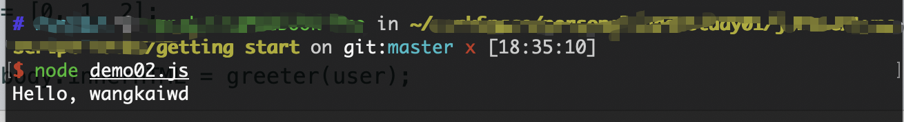

## 快速开始
> 这里使用的是`mac`操作系统,包管理工具是`yarn`。

特别提示： 
* 文章中的操作都是在`getting start`目录下进行的，要留意执行命令时自己的命令。  
* 参考资料  
  * 英文：[`TypeScript in 5 minutes`](https://www.typescriptlang.org/docs/handbook/typescript-in-5-minutes.html)  
  * 中文：[5分钟上手`TypeScript`](https://www.tslang.cn/docs/handbook/typescript-in-5-minutes.html)

### 编译第一个`.ts`文件
要使用`typescript`,首先我们通过`yarn`全局安装`typescript`:  
```text
yarn global add typescript
```
这里会提示安装成功，之后我们新建`demo01.ts`:  
```typescript
const greeter = (person) => {
  return `Hello, ${person}`;
};
let person = 'wangkaiwd';

document.body.innerHTML = greeter(person);
```

完成之后我们在命令行运行`TypeScript`编译器： 
```text
tsc demo01.ts
```
这里会提示`command not found`,这是因为在不同的操作系统上执行`yarn global`命令会出现一些问题，我用下面的方法成功安装：  
> `yarn global`没有执行成功的相关资料：  
> * [Yarn global command not working](https://stackoverflow.com/questions/40317578/yarn-global-command-not-working)
> * [global binaries don't install on mac os sierra](https://github.com/yarnpkg/yarn/issues/1321)

```text
yarn global bin

yarn config set prefix ~/.yarn

使用了zsh的用户要在.zshrc中添加全局路径
vim ~/.zshrc
export PATH="$PATH:`yarn global bin`"
```

执行上述代码之后保存退出`vim`模式，重新执行:  
```text
yarn global add typescript
tsc demo01.ts
```
这时代码会成功执行。

> 这里简单解释下`tsc`命令，它的全称是： `type script compiler`,翻译成中文就是`typescript`编译器，用来将`.ts`文件编译为`.js`文件。

为了能方便我们快速学习，这里我们结合`nodeJs`来学习`typescript`。由于`node`中并没有`DOM`和`BOM`，所以我们将代码中有关`DOM`操作的部分删除，直接打印输出： 
```typescript
const greeter = (person) => {
  return `Hello, ${person}`;
};
let person = 'wangkaiwd';

console.log(person);
``` 
接下来命令行执行：  
```npm
tsc demo01.ts
node demo01.js
```


接下来我们就通过这个套路愉快的学习吧

### 类型注解
> `TypeScript`里的类型注解是一种轻量级的为函数或变量添加约束的方式

从这里开始，我们就可以体验`TypeScript`工具带来的高级功能了。

上面的例子中，我们希望`greeter`接收的参数为`string`类型：  
```typescript
// demo02.ts
const greeter = (person: string) => {
  return `Hello, ${person}`;
};
const person = 'wangkaiwd';
console.log(greeter(person));
```
重新编译：  
```npm
tsc demo02.ts
node demo02.js
```
命令行依旧会成功输出： `Hello, wangkaiwd`。

接下来我们干一些坏事情，看看`TypeScript`的厉害之处： 
```typescript
const greeter = (person: string) => {
  return `Hello, ${person}`;
};

// console.log(greeter()); // expected 1 arguments,but got 0
// console.log(greeter('name1', 'name2')); // expected 1 arguments,but got 2
// const person = null; // Hello, null
// const person = undefined; // Hello, undefined
// const person = 10; // arguments of type 10 is not assignable to parameter of type 'string'
// const person = [1, 2, 3]; // arguments of type 'number[]' is not assignable to parameter of type 'string'

const person = 'wangkaiwd';
console.log(greeter(person));
``` 

经过我们的尝试，可以看到`TypeScript`比较强大的地方：  
* 可以分析传入参数的类型是否正确
* 可以分析传入参数的数量是否符合要求
* `null`和`undefined`是所有类型的子类型，这里可以把`null`和`undefined`赋值给`string`类型的变量。我们可以在配置文件中指定`--strictNullChecks`标记，这样`null`和`undefined`就只能赋值给`void`和它们各自，这能避免很多常见的问题

不过虽然命令行提示`error`信息，但是代码还是被成功编译成了`js`。就算你的代码里有错误，你仍然可以使用`TypeScript`,但在这种情况下，`TypeScript`会警告你代码可能不会按预期执行。

### 接口
下面的例子中我们用接口来描述一个拥有`firstName`和`lastName`字段的对象： 
```typescript
interface Person {
  firstName: string,
  lastName: string
}

const greeter = (person: Person) => {
  return `Hello, ${person.firstName} ${person.lastName}`;
};

const person = { firstName: 'name1', lastName: 'name2' };

console.log(greeter(person));
```
可以看到函数的参数必须要包含接口`Person`的结构才不会报错

### 类
`TypeScript`支持`JavaScript`的新特性，我们使用`class`来改写这个例子：  
```typescript
class Student {
  fullName: string;
  // public会同时在实例上添加相应的属性：
  // 相当于如下代码:
  // firstName: string;
  // middleInitial: string;
  // lastName: string;
  //
  // constructor (firstName: string, middleInitial: string, lastName: string) {
  //   this.firstName = firstName;
  //   this.middleInitial = middleInitial;
  //   this.lastName = lastName;
  // }
  constructor (public firstName: string, public middleInitial: string, public lastName: string) {
    this.fullName = `${firstName} ${middleInitial} ${lastName}`;
  }
}
interface Person {
  firstName: string,
  lastName: string
}
const greeter = (person: Person) => {
  return `Hello, ${person.firstName} ${person.lastName}`;
};
const person = new Student('Jane', 'M.', 'User');
console.log(greeter(person)); // hello, Jane User
```

### 运行`TypeScript` `Web`应用
最后我们在页面中看一下效果

创建`index.html`: 
```html
<!doctype html>
<html lang="en">
<head>
  <meta charset="UTF-8">
  <meta name="viewport"
        content="width=device-width, user-scalable=no, initial-scale=1.0, maximum-scale=1.0, minimum-scale=1.0">
  <meta http-equiv="X-UA-Compatible" content="ie=edge">
  <title>Document</title>
</head>
<body>
<script src="./demo05.js"></script>
</body>
</html>
```
编译`demo05.ts`文件： 
```typescript
class Student {
  fullName: string;

  constructor (public firstName, public lastName) {
    this.fullName = `${firstName} ${lastName}`;
  }
}
interface Person {
  firstName: string,
  lastName: string
}
const greeter = (person: Person) => {
  return `Hello, ${person.firstName} ${person.lastName}`;
};
const person = new Student('Type', 'Script');
document.body.innerHTML = greeter(person);
```
```text
tsc demo05.ts
```
之后再浏览器中打开`html`文件  


到这里我们已经了解了一个简单的`TypeScript`应用如何编写，接下来我们一起对其中的细节进行深入研究和应用。
