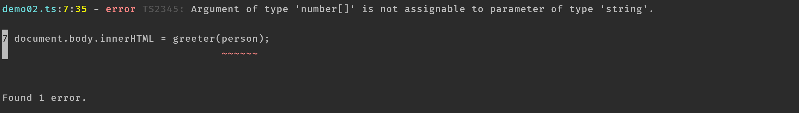

## 快速开始
> 这里使用的是`mac`操作系统
### 编译第一个`.ts`文件
首先我们通过`yarn`全局安装`typescript`:  
```text
yarn global add typescript
```
这里会提示安装成功，之后我们新建`demo01.ts`:  
```typescript
const greeter = (person) => {
  return `Hello, ${person}`;
};
let person = 'wangkaiwd';

document.body.innerHTML = greeter(person);
```

之后我们在命令行上运行`TypeScript`编译器： 
```text
tsc demo01.ts
```
这里会提示`command not found`,这是因为在不同的操作系统上执行`yarn global`命令会出现一些问题，我用下面的方法成功安装：  
> `yarn global`没有执行成功的相关资料：  
> * [Yarn global command not working](https://stackoverflow.com/questions/40317578/yarn-global-command-not-working)
> * [global binaries don't install on mac os sierra](https://github.com/yarnpkg/yarn/issues/1321)

```text
yarn global bin

yarn config set prefix ~/.yarn

使用了zsh的用户要在.zshrc中添加全局路径
vim ~/.zshrc
export PATH="$PATH:`yarn global bin`"
```

执行上述代码之后保存退出`vim`模式，重新执行:  
```text
yarn global add typescript
tsc demo01.ts
```
这时代码会成功执行。

### 类型注解
> `TypeScript`里的类型注解是一种轻量级的为函数或变量添加约束的方式

我们希望`greeter`接收的参数为`string`类型：  
```typescript
// demo02.ts
const greeter = (person:string) => {
  return `Hello, ${person}`;
};
const person = [1,2,3]
greeter(person)
```
重新编译：  
```text
tsc demo02.ts
```


当我们参数的个数传递有问题时，`ts`代码也会报错。从这个`demo`中可以看到`TypeScript`比较强大的地方：  
* 可以分析传入参数的类型是否正确
* 可以分析传入参数的数量是否符合要求

不过虽然命令行提示`error`信息，但是代码还是被成功编译成了`js`。就算你的代码里有错误，你仍然可以使用`TypeScript`,但在这种情况下，`TypeScript`会警告你代码可能不会按预期执行。

