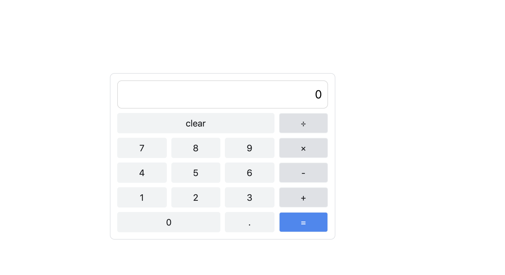

## 案例实践

### 计算器
这里我们通过使用面向对象实现一个简单的计算器来巩固我们的`TS`中`class`的使用以及`DOM`操作。

#### 配置代码编写环境
首先我们新建`index.html`页面来引入生成的`js`文件：  
```html
<!doctype html>
<html lang="zh">
<head>
  <meta charset="UTF-8">
  <meta name="viewport"
        content="width=device-width, user-scalable=no, initial-scale=1.0, maximum-scale=1.0, minimum-scale=1.0">
  <meta http-equiv="X-UA-Compatible" content="ie=edge">
  <title>Document</title>
</head>
<body>
<div class="calculator">

</div>
<script src="./demo04.js"></script>
</body>
</html>
```
接下来我们通过`tsc`命令来实时编译`demo04.ts`文件：  
```npm
npx tsc -w demo04.ts
```

这样我们就可以在`demo04.ts`中愉快的编写代码了。

#### 实战开始
在开始之前我们可以简单看下最终的效果：


由于`css`的编写不是我们学习的重点，这里我已经将`css`写好了，想要学习的小伙伴可以直接使用: [传送门](./index.html)

在我们使用计算器的时候希望通过如下代码来实现：  
```typescript
const calculator = new Calculator('.calculator');
```

根据这个思路，我们需要在定义的`class`中通过传入的字符串来获取到对应的`DOM`元素：  
```typescript
class Calculator {
  element: HTMLElement;

  constructor (selector: string) {
    this.element = document.querySelector<HTMLElement>(selector)!;
  }
}
```

这里小伙伴们可能会对`!`这个符号比较疑惑，在`ts`中在变量后边的`!`非空(`non-null`)断言操作符。有时候我们可以确认当前操作的值不会是`null`和`undefined`，但是编译器可能并不知道，它总是会考虑最全面的情况。这里我们通过`!`操作符来向编译器传达当前值不是`null`和`undefined`，编译器就不会再进行错误提示。
> 关于`stack overflow`的讨论可以看这里： https://stackoverflow.com/questions/43951090/typescript-object-is-possibly-null

接下来我们要把计算器中的按钮插入到页面中：  
```typescript
class Calculator {
  element: HTMLElement;
  textList: string[] = ['clear', '/', '7', '8', '9', 'x', '4', '5', '6', '-', '1', '2', '3', '+', '0', '.', '='];

  constructor (selector: string) {
    this.element = document.querySelector<HTMLElement>(selector)!;
    this.initButtons();
  }

  initButtons () {
    this.textList.forEach((text:string) => {
      this.createButton(text, `item-${text}`);
    });
  }

  createButton (text: string, className: string) {
    // 这里多创建一个div的目的是要通过padding来间隔子元素button
    const div: HTMLDivElement = document.createElement('div');
    const button: HTMLButtonElement = document.createElement('button');
    button.classList.add('button');
    button.innerText = text;
    div.classList.add('col', className);
    div.appendChild(button);
    this.element.appendChild(div);
  }
}
```

我们将计算器中的按钮定义为一个数组，然后遍历数组，将每个按钮插入到页面中。在插入时，我们为每个按钮添加了对应的`class`，这可以帮助我们方便的对样式进行修改

